# Judikatura AI - ověřené citace

Demo z mini-hackathonu CODEXIS. **Popište případ vlastními slovy → hybridní RAG nad reálnými
rozhodnutími z otevřených dat justice.cz → argumenty pro i proti s citacemi → deterministické
ověření každé citace proti databázi.**

> **AI formuluje, deterministika rozhoduje.** Model nikdy nerozhoduje o tom, co je relevantní,
> jaká jsou čísla ani zda citace existuje.

## Screenshoty

Reálný běh nad snapshotem 300 rozhodnutí, otázka č. 2 z [`data/demo-questions.md`](data/demo-questions.md)
(bezdůvodné obohacení z neplatné úvěrové smlouvy).

| | |
|---|---|
| **Dotaz vlastními slovy** | 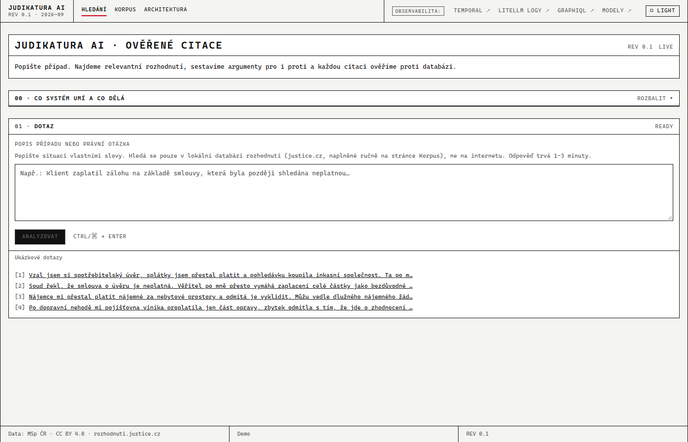 |
| **Živý graf agenta** (LangGraph4j, fan-out do tří větví, smyčka reargue) | 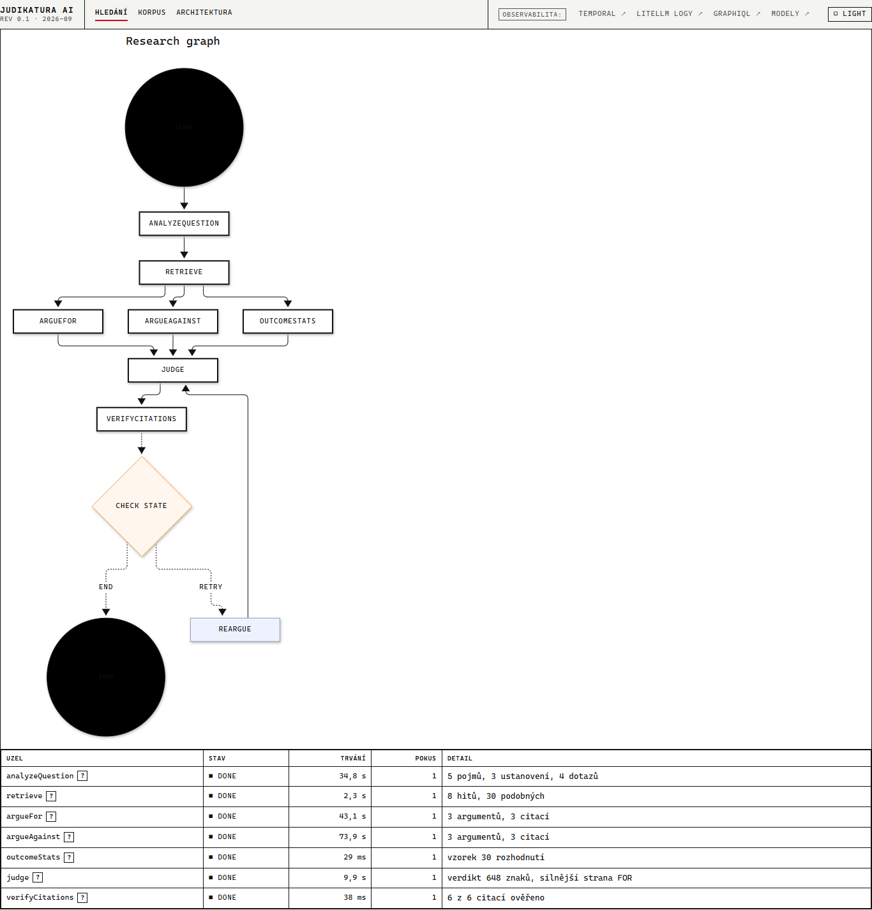 |
| **Analýza dotazu** (pojmy, ustanovení, vyhledávací dotazy) | 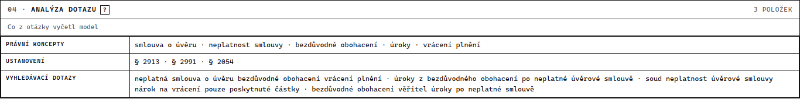 |
| **Nalezená rozhodnutí** (hybridní hledání, skóre vektor + fulltext, RRF) | 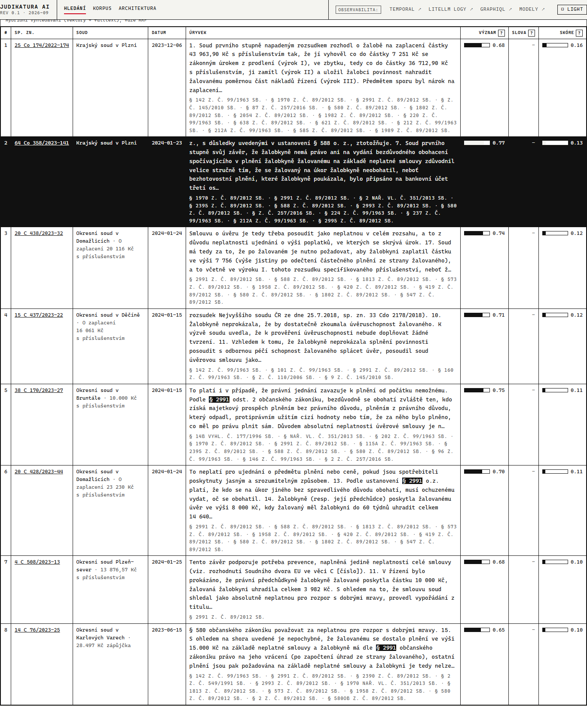 |
| **Statistika výsledků** ze 30 podobných sporů, počítá kód | 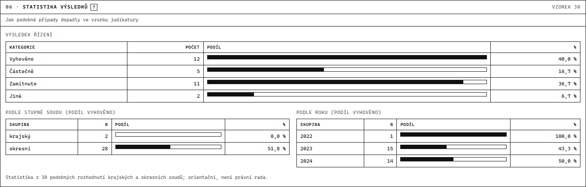 |
| **Advocatus Diaboli**: argumenty pro klienta i protistranu | 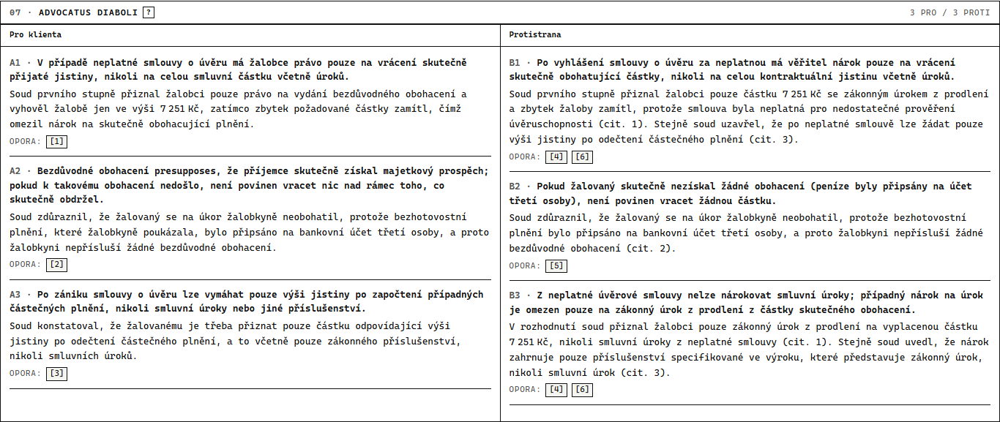 |
| **Verdikt**: která strana je silnější a proč | 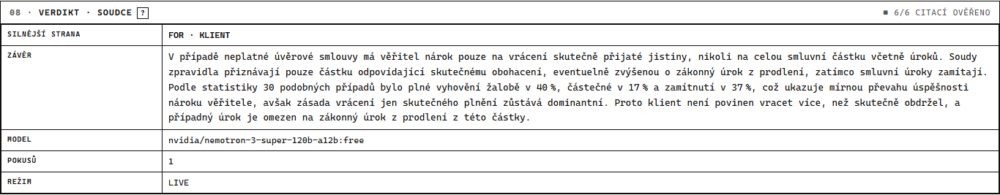 |
| **Ověření citací** proti textu rozhodnutí v databázi | 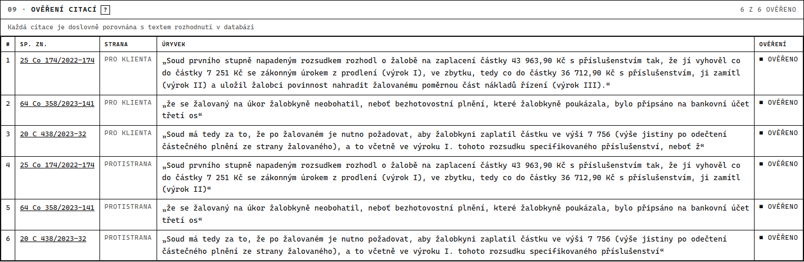 |
| **Technická stopa**: vrstvy, trvání, skutečně použitý model | 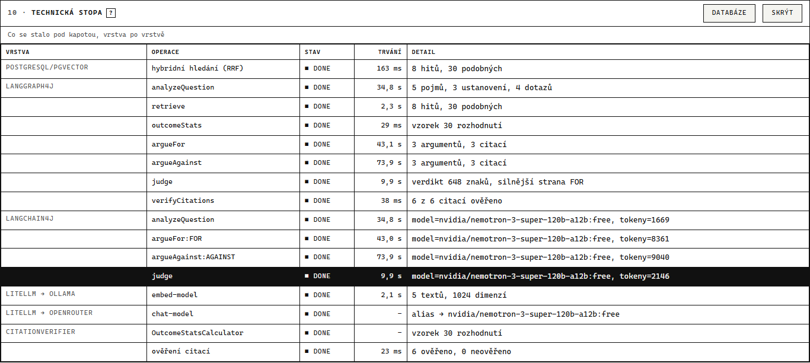 |
| **Databáze**: tabulky, indexy a řádky `chunk` s embeddingem a tsvectorem | 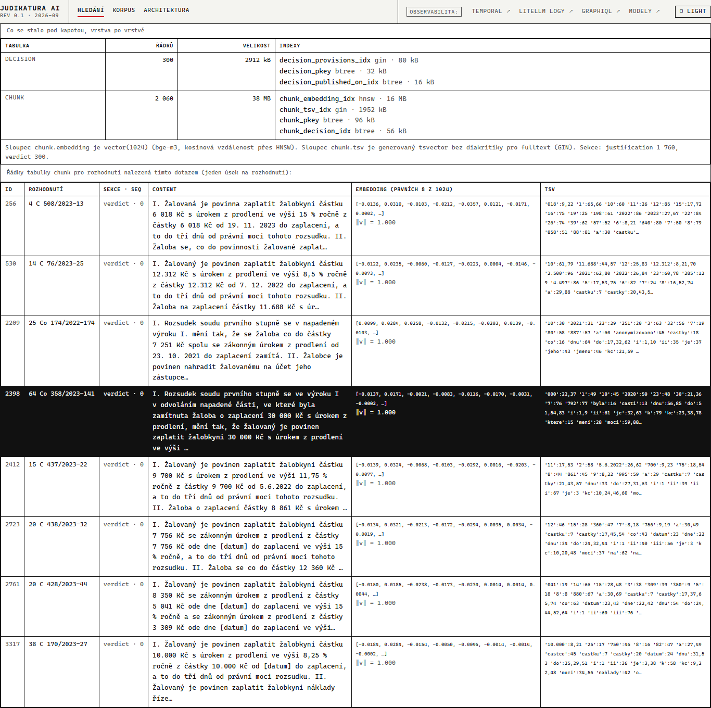 |
| **Korpus**: ingest z justice.cz přes Temporal | 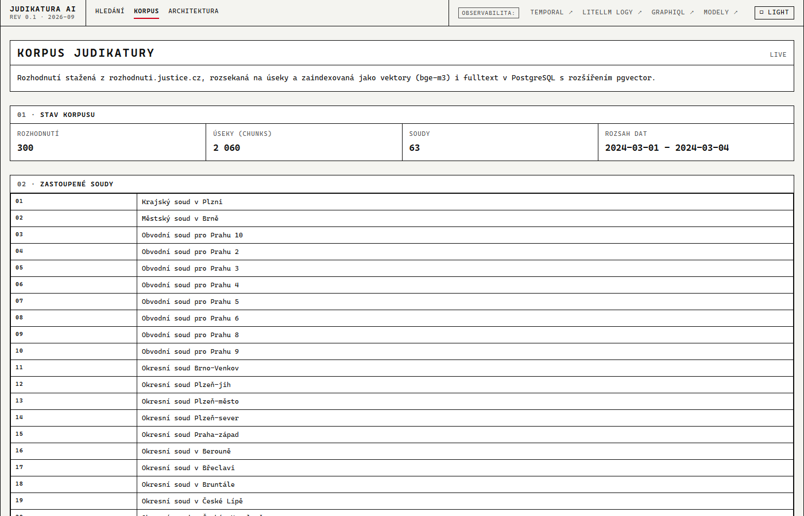 |

## Quick start

**Předpoklady:** Docker Desktop (nic víc - Java ani Node lokálně nejsou potřeba, build běží v Dockeru).

```bash
cp .env.example .env
# do .env doplnit OPENROUTER_API_KEY (free klíč z https://openrouter.ai)
docker compose up --build
```

První spuštění trvá déle: Ollama stahuje embedding model `bge-m3` (~1,2 GB, jednorázově)
a Maven stahuje závislosti backendu.

| Co | URL |
|---|---|
| UI | http://localhost:3000 |
| GraphiQL (API playground) | http://localhost:8081/graphiql |
| Temporal UI | http://localhost:8233 |
| LiteLLM - seznam modelů | http://localhost:8081/api/llm/models |
| LiteLLM Admin UI (log požadavků, spotřeba, modely; login admin/admin z `.env`) | http://localhost:4000/ui |
| Health backendu | http://localhost:8081/actuator/health |

**Bez klíče nebo bez internetu:**

```bash
AI_MOCK=true          # žádná volání chat modelu, deterministické odpovědi (embeddingy běží dál)
INGEST_SOURCE=snapshot  # ingest z data/snapshot místo z justice.cz
```

## Co systém umí a co dělá

- **Vstup:** popis případu nebo právní otázka vlastními slovy (česky).
- **Data:** otevřená data MSp ČR (rozhodnuti.justice.cz), anonymizovaná rozhodnutí okresních, krajských
  a vrchních soudů, CC BY 4.0. Nic se neprohledává na internetu, jen lokální PostgreSQL databáze.
- **Obnova dat:** neprobíhá automaticky. Korpus se plní ručně na `/corpus` tlačítkem *Spustit ingest*
  za zvolené období zveřejnění (Temporal `IngestWorkflow`: stažení → chunking → embeddingy v Ollamě → uložení).
  Aktuální stav korpusu ukazuje `corpusStats` a sekce *00 · Co systém umí* na úvodní stránce.
- **Zpracování dotazu:** AI přeloží otázku na pojmy, § a vyhledávací dotazy → kód hledá hybridně
  (pgvector + fulltext, fúze RRF) a vybere 8 rozhodnutí + 30 podobných → AI sestaví argumenty pro klienta
  i protistranu a verdikt, kód spočítá statistiku výsledků podobných sporů → kód ověří každou citaci
  (rozhodnutí musí být mezi nalezenými, úryvek musí v textu doslova existovat), neověřené se označí
  červeně a AI dostane jednu opravu.
- **Embedování:** bge-m3 v lokální Ollamě (přes LiteLLM alias `embed-model`, 1024 dimenzí). Probíhá
  (1) při ingestu pro každý úsek rozhodnutí (uloženo v pgvector, index HNSW) a (2) při dotazu pro
  vyhledávací dotazy; stejný model na obou stranách, chat model embeddingy nedělá.
- **Hranice:** AI jen formuluje; pořadí, statistiku a existenci citací rozhoduje deterministický kód.
  Témata mimo korpus najde jen přibližně; NS/NSS/ÚS chybí (bez API); nesleduje pozdější změny rozhodnutí;
  není to právní rada.

## Architektura

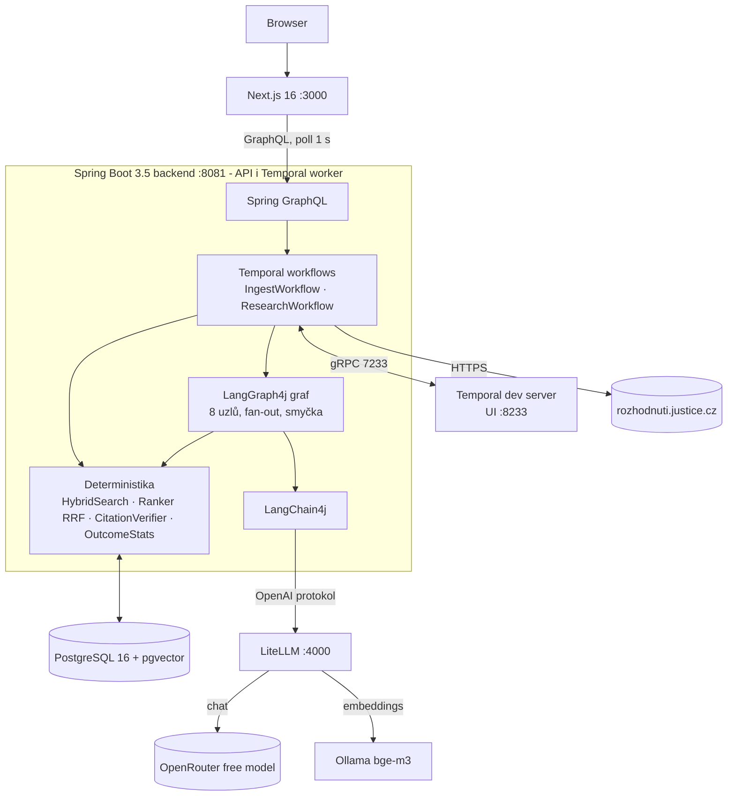

## Demo

**1. Naplnit korpus** - http://localhost:3000/corpus
- from `2024-03-01`, to `2024-03-04`, limit `300` → *Spustit ingest*
  (offline varianta: `INGEST_SOURCE=snapshot`, stejné datumy).
- Během běhu otevřít **Temporal UI** (http://localhost:8233) a ukázat stovky paralelních
  aktivit, retry a heartbeaty.

**2. Položit dotaz** - http://localhost:3000
- Vzít otázku z [`data/demo-questions.md`](data/demo-questions.md), např. spotřebitelský úvěr
  postoupený inkasní agentuře.
- Sledovat **živý graf**: `analyzeQuestion` → `retrieve` (hity se objeví dřív než odpověď) →
  `argueFor` ∥ `argueAgainst` ∥ `outcomeStats` svítí současně → `judge` → `verifyCitations`.
- Prohlédnout výsledky: dva sloupce argumentů, verdikt, graf šancí na úspěch a **seznam citací**
  - zelená „ověřeno v textu rozhodnutí", červená s důvodem. Kliknutí otevře text rozhodnutí
  se zvýrazněným citátem a odkazem na justice.cz.
- Dole **Technical Trace**: vrstvy, trvání, skutečně použitý model.

**3. Ukázat gateway** - http://localhost:8081/api/llm/models
- Aplikace zná jen aliasy `chat-model` a `embed-model`. Chat běží v cloudu, embeddingy lokálně.
  Model se mění v `.env`, Java se nepřekládá.

**4. Ukázat durabilitu**
- Spustit nový ingest a uprostřed `docker compose restart backend`.
  Po startu workera workflow pokračuje tam, kde bylo; už stažená rozhodnutí přeskočí.

## Technologická mapa

| Technologie | Role | Co v demu dokazuje |
|---|---|---|
| Next.js 16 | UI, polling GraphQL, Mermaid s živým barvením uzlů | živý průběh agenta, zelené/červené citace |
| Spring for GraphQL | jedno schéma pro celé UI | GraphiQL, API bez frontendu |
| **Temporal** | orchestrace business workflow: retry, timeouty, heartbeat, query, signál | stovky aktivit v UI, ingest přežije restart backendu |
| **LangGraph4j** | orchestrace AI agenta jako stavový graf | paralelní Advocatus Diaboli, smyčka při neověřené citaci, diagram z kódu |
| **LangChain4j** | stavební kameny pro LLM: ChatModel, EmbeddingModel, AiServices, `@Tool` | strukturovaný JSON výstup bez ručního parsování |
| **LiteLLM** | LLM gateway, aliasy a fallbacky | změna modelu bez rebuildu, `/models` |
| **OpenRouter** | poskytovatel chat modelu (`google/gemma-4-31b-it:free`) | demo zdarma |
| **Ollama** | lokální runtime embeddingů (`bge-m3`, 1024 dim) | data neopouští stroj |
| **PostgreSQL + pgvector** | korpus + hybridní retrieval (kNN + tsvector) | jeden SQL dotaz místo druhé databáze |
| **Ranker (RRF)** | deterministické sloučení pořadí | stejný dotaz = stejné pořadí |
| **CitationVerifier** | deterministické ověření citací | červená badge + smyčka „přepiš argument" |
| **OutcomeStatsCalculator** | deterministická statistika výsledků | šanci na úspěch počítá kód, ne model |
| **Technical Trace (Java)** | tabulka vrstev s délkami kroků přímo v UI | kde se ztratil čas, bez externí služby |

## Vysvětlení na 2 minuty

„Chat s citacemi" už mají všichni - CODEXIS AI Agent, ASPI Libra i Beck-Noxtua. Reálný problém
je jinde: **AI si vymýšlí judikáty.** NSS už za takové podání pokutoval advokáta, Ústavní soud
AI podání kritizoval a ČAK připomněla, že odpovědnost nese advokát.

Tohle demo řeší dva problémy najednou. Popíšete případ vlastními slovy - ne klíčovými slovy.
Hybridní vyhledání (vektorové + fulltextové) nad reálnými rozhodnutími najde relevantní
judikaturu. Model z ní sestaví argumenty **ve dvou sloupcích: pro klienta i proti němu**,
takže právník vidí slabiny svého případu dřív než u soudu. Vedle toho se z výsledků třiceti
nejpodobnějších sporů spočítá šance na úspěch - čísla počítá kód, model je jen komentuje.

A hlavní věc: **každou citaci ověří deterministický Java kód proti databázi.** Musí existovat
rozhodnutí s tím ID a citovaná věta musí být v jeho textu. Když si model citaci vymyslí,
systém ji označí červeně a pošle ho argument přepsat.

**AI formuluje, deterministika rozhoduje.** To je produktová pointa: důvěryhodnost jako feature.
A dá se nasadit i před stávajícího AI agenta - je to čistá funkce nad korpusem, který CODEXIS má.

## CI (GitHub Actions)

`.github/workflows/ci.yml` spouští na každý push a pull request dva paralelní joby: `backend-test` (`mvn test`,
JUnit report jako artefakt) a `frontend-test` (`npm ci`, lint, build). Na pushi navíc `docker-build` ověří, že se oba image postaví.
Testy nepotřebují žádné externí služby.

## Data

Zdroj dat: **Ministerstvo spravedlnosti ČR - rozhodnuti.justice.cz**, licence
**CC BY 4.0**. Demo pracuje s rozhodnutími okresních, obvodních a městských soudů
zveřejněnými 1.-4. 3. 2024 (snapshot v `data/snapshot/`, 300 rozhodnutí).
Judikatura NS, NSS a ÚS není součástí - tyto soudy otevřené API nemají.

Statistiky o výsledcích sporů jsou **orientační a nejsou právní radou**.
